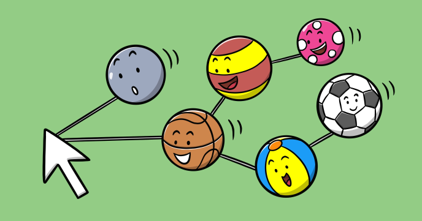

Is *Mouse connections* the right name for this program? ... or maybe should be named *Spider connections*?

Run it to see why the dilema!

The program is a variation on the [Mutual connections](tutorial://mutual_connections) graphic effect also present on CodeGuppy.

A series of balls are bouncing from the edges of the canvas. Connections are created on the fly from the mouse cursor to each ball that is in a certain range from the cursor.
 
## Source code 
The JavaScript source code of this program can be found [here](sketches/program.js). To run it, you need to import it in the [codeguppy.com](https://codeguppy.com) online editor. Alternatively, you can use the source code in your p5.js sketches (advanced use). 
## Online version 
To see the code running, check the online playground at [https://codeguppy.com/code.html?t=mouse_connections](https://codeguppy.com/code.html?t=mouse_connections) 
## Next steps 
Please check [codeguppy.com](https://codeguppy.com) for many other fun JavaScript programs and games for beginners. To stay up to date with CodeGuppy development please follow [@codeguppy](https://twitter.com/codeguppy) on Twitter.  
